# 🤖 Automated Country Page Generation

This document explains how the automated country page generation system works in this repository.

## 🎯 Overview

Contributors only need to update `data/companies.json`. All country pages are automatically generated from this single source of truth using GitHub Actions.

## 🔄 How It Works

```mermaid
graph TB
    A[Contributor edits companies.json] --> B[Submits Pull Request]
    B --> C[GitHub Actions Triggered]
    C --> D{JSON Valid?}
    D -->|No| E[❌ PR Check Fails]
    D -->|Yes| F[✅ PR Check Passes]
    F --> G[Maintainer Merges PR]
    G --> H[GitHub Actions Triggered Again]
    H --> I[Generate Country Pages]
    I --> J[Validate Generated Content]
    J --> K[Update Statistics]
    K --> L[Auto-commit Generated Files]
    L --> M[🎉 Country Pages Updated!]
```



## 🛠️ Technical Components

### 1. Generation Script (`scripts/generate-country-pages.js`)

**Purpose**: Converts JSON data into markdown pages

**Features**:

- Reads `data/companies.json`
- Groups companies by industry within each country
- Uses detailed templates for major countries (Netherlands, Germany, Sweden, UK)
- Uses simple templates for smaller countries
- Automatically sorts companies and industries
- Generates market insights, salary ranges, visa information
- Creates comprehensive index page

**Usage**:

```bash
node scripts/generate-country-pages.js
# or
npm run generate-pages
```

### 2. GitHub Actions Workflow (`.github/workflows/update-country-pages.yml`)

**Triggers**:

- When `data/companies.json` is modified in a PR
- When PRs with JSON changes are merged
- Manual workflow dispatch

**Process**:

1. **Validate JSON**: Check syntax and structure
2. **Generate Pages**: Run the Node.js generation script
3. **Run Validations**: Execute data integrity checks
4. **Check Changes**: Detect if pages need updating
5. **Auto-commit**: Commit and push generated pages
6. **Comment on PR**: Provide status update

### 3. Package.json Scripts

**Available commands**:

```bash
npm run generate-pages  # Generate all country pages
npm run validate        # Validate JSON structure
npm run stats          # Generate statistics
npm run build          # Generate + validate
npm run all-checks     # Run all validation scripts
```

### 4. Bash Wrapper (`scripts/generate-all.sh`)

**Purpose**: Complete regeneration with validation and statistics

**Usage**:

```bash
./scripts/generate-all.sh
```

## 📊 Page Templates

### Detailed Pages (10+ companies)

Used for major countries like Netherlands, Germany, Sweden, UK.

**Includes**:

- Market overview and insights
- "Why this country?" section
- Companies grouped by industry
- Job search tips and application strategies
- Visa information and requirements
- Salary ranges and market insights
- City information and insider tips

### Simple Pages (1-9 companies)

Used for smaller countries.

**Includes**:

- Basic overview
- Company listings (grouped by industry if applicable)
- Essential job search tips
- Basic visa information

### Index Page

The main countries index (`docs/countries.md`) includes:

- Complete country directory
- Industry-based navigation
- Market trends and insights
- Top destinations analysis
- Quick navigation tools

## 🎨 Country Configuration

Countries are configured in the generation script with metadata:

```javascript
const COUNTRY_CONFIG = {
  netherlands: {
    flag: '🇳🇱',
    name: 'Netherlands',
    cities: 'Amsterdam, The Hague, Utrecht, Eindhoven',
    description: 'Market description...',
    whySection: ['Reason 1', 'Reason 2', ...],
    visaInfo: ['Visa type 1', 'Visa type 2', ...],
    salaryRanges: ['Junior: €X', 'Senior: €Y', ...]
  }
}
```

## 🔄 Automated Features

### Data Processing

- **Industry Grouping**: Companies automatically categorized by industry
- **Alphabetical Sorting**: Companies sorted within each industry
- **Top Industries**: Automatically calculated for each country
- **Statistics**: Company counts and percentages updated automatically

### Quality Control

- **JSON Validation**: Structure and syntax verification
- **Required Fields**: All companies must have name, website, linkedin, industry
- **URL Validation**: Website and LinkedIn URLs checked for format
- **Duplicate Detection**: Automatically identifies potential duplicates

### Content Generation

- **Consistent Formatting**: All pages follow identical structure
- **Dynamic Content**: Page content adapts to number of companies
- **Market Insights**: Industry trends calculated from data
- **Cross-references**: Automatic linking between pages

## 🚀 Benefits for Contributors

### Simplified Workflow

- **Single File**: Only edit `data/companies.json`
- **No Markdown**: No need to understand markdown formatting
- **Automatic Validation**: Immediate feedback on data quality
- **Consistent Results**: All pages formatted identically

### Quality Assurance

- **Automated Checks**: JSON structure validation
- **Link Verification**: URL format checking
- **Duplicate Prevention**: Automatic duplicate detection
- **Data Integrity**: Consistent industry categorization

### Immediate Results

- **Real-time Feedback**: GitHub Actions provide instant validation
- **Auto-generation**: Pages appear immediately after merge
- **Statistics Updates**: Company counts automatically updated
- **Professional Output**: Consistent, high-quality pages

## 🛠️ Maintenance

### Adding New Countries

1. Add country data to `companies.json`
2. Optionally add country configuration to generation script
3. Pages generate automatically

### Updating Templates

1. Modify templates in `generate-country-pages.js`
2. Run generation script to test
3. All pages update consistently

### Adding Features

1. Update generation script
2. Test with `npm run generate-pages`
3. GitHub Actions will use new version automatically

## 📈 Statistics and Analytics

The system automatically tracks:

- Total companies per country
- Industry distribution
- Data completeness (LinkedIn profiles, etc.)
- Potential duplicates
- URL analysis (HTTPS adoption, career pages)
- Market insights and trends

## 🔍 Troubleshooting

### Common Issues

**JSON Syntax Errors**:

- Use online JSON validator
- Check for trailing commas
- Verify quote matching

**GitHub Actions Failing**:

- Check Actions tab in GitHub
- Review error messages
- Validate JSON locally first

**Missing Generated Content**:

- Ensure GitHub Actions completed successfully
- Check for uncommitted changes
- Run generation script locally

### Getting Help

- **GitHub Issues**: Report technical problems
- **Discussions**: Ask questions about the system
- **Documentation**: Check this file and CONTRIBUTING.md
- **Local Testing**: Run scripts locally before submitting PRs

## 🎯 Future Enhancements

Planned improvements:

- **Link Validation**: Automatic URL accessibility checking
- **SEO Optimization**: Meta tags and structured data
- **Search Functionality**: Client-side search within pages
- **Export Options**: PDF, CSV exports of data
- **Analytics**: Usage tracking and insights
- **Multilingual**: Support for multiple languages

---

_This automated system ensures that our repository scales efficiently while maintaining high quality and consistency across all country pages._
